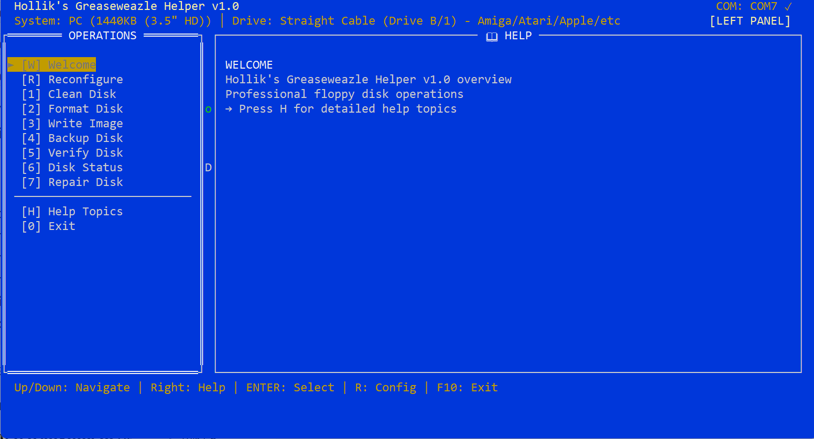
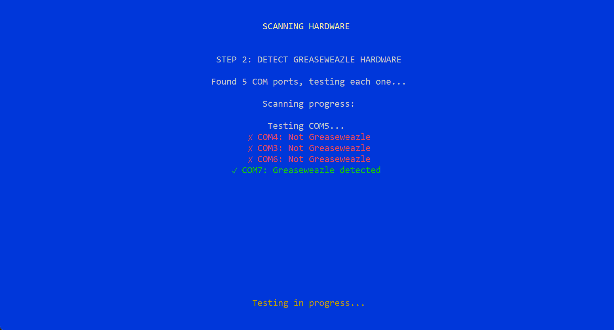
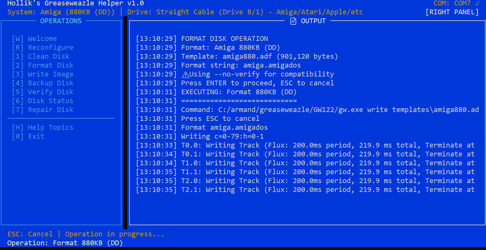
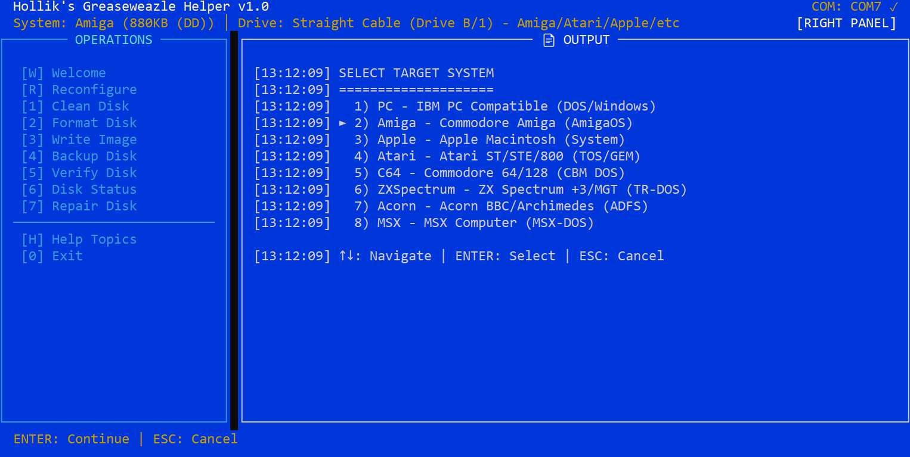
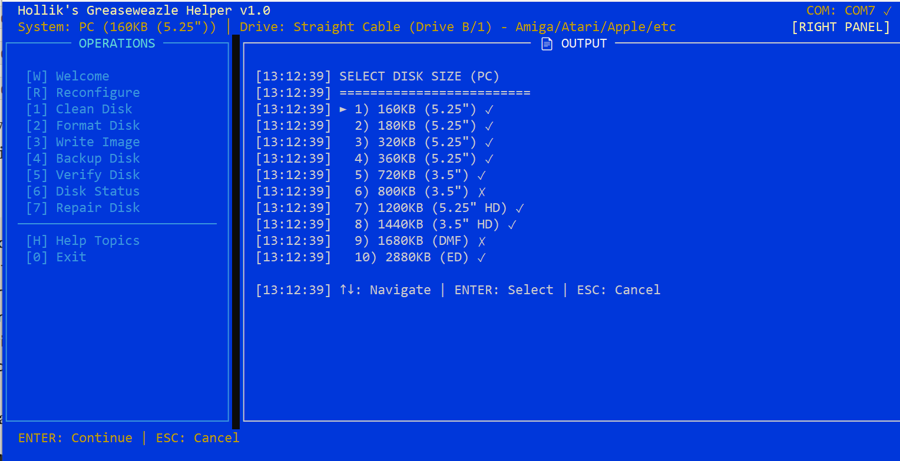
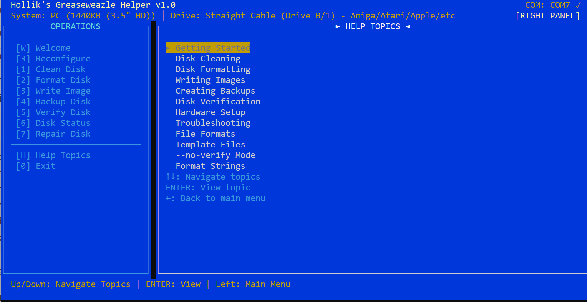
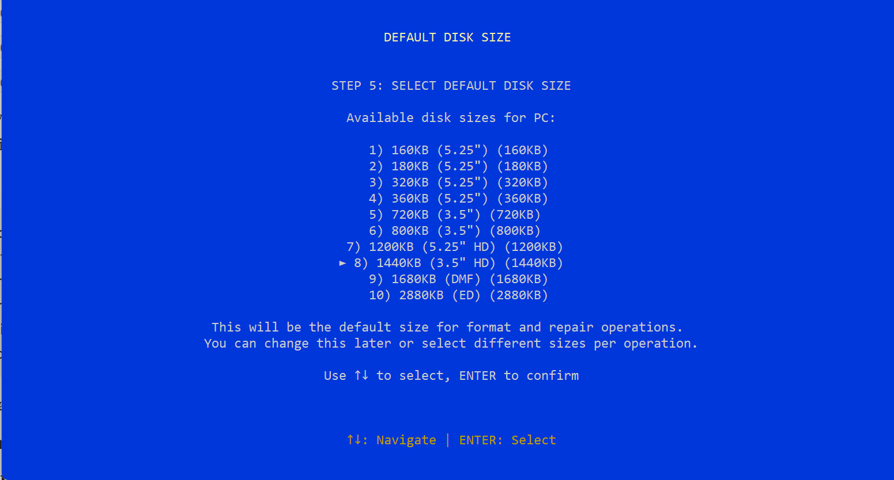

# Hollik's Greaseweazle Helper v1.0

🎛️ **Professional dual-panel interface for Greaseweazle floppy disk operations**

A comprehensive, user-friendly terminal interface that makes Greaseweazle floppy disk operations simple and reliable. Features a classic dual-panel design with extensive help system and support for multiple retro computer formats.

## 📸 Screenshots

<div align="center">
  <a href="screenshot1.png">
    
  </a>
  <a href="screenshot2.png">
    
  </a>
  <a href="screenshot3.png">
    
  </a>
  <br>
  <a href="screenshot4.png">
    
  </a>
  <a href="screenshot5.png">
    
  </a>
  <a href="screenshot6.png">
    
  </a>
  <br>
  <a href="screenshot7.png">
    
  </a>
  <br>
  <em>Click images to enlarge</em>
</div>

## 🚀 Quick Install

### Windows Executable (Recommended)
1. **Download** `greaseweazle-helper.exe` from [Releases](../../releases)
2. **Run** the executable - no installation required!
3. **For formatting operations**: Create `templates/` folder next to the .exe and add template files
4. **Follow** the setup wizard to configure your Greaseweazle

### Python Script (All Platforms)
1. **Install Python 3.7+** and run: `pip install pyserial`
2. **Download** or clone this repository
3. **Run**: `python ngw24.py`
4. **Add templates** to `templates/` folder for formatting

> **💡 Tip**: The app works without templates for backup/verify operations. Templates are only needed for disk formatting.

## ✨ Key Features

- **🚫 No More Verify Failures**: Uses `--no-verify` by default to prevent "Failed to verify Track 0.0" errors
- **📐 Official Format Strings**: Implements correct format strings from the Yann Serra Tutorial
- **🔍 Smart Hardware Detection**: Automatically scans and detects Greaseweazle devices on all COM ports
- **🖥️ Classic Dual-Panel Design**: Familiar file manager interface with comprehensive navigation
- **🔧 Multi-System Support**: PC, Amiga, Apple, Atari ST, C64, ZX Spectrum + more
- **📁 Proper File Extensions**: System-specific file extensions (.img, .adf, .st, .d64, .mgt)
- **📚 Built-in Help**: Extensive help system with step-by-step guides
- **⚙️ One-Click Setup**: Guided wizard configures everything automatically

## 🎯 Supported Systems

| System | Formats | Extensions |
|--------|---------|------------|
| **PC (IBM)** | 160KB-2.88MB | `.img`, `.ima` |
| **Amiga** | 880KB, 1.76MB | `.adf` |
| **Apple Mac** | 400KB, 800KB | `.dsk` |
| **Atari ST** | 360KB-880KB | `.st`, `.msa` |
| **Commodore 64** | 170KB-800KB | `.d64`, `.d71`, `.d81` |
| **ZX Spectrum** | 640KB, 800KB | `.mgt`, `.dsk` |
| **Acorn BBC** | 160KB-1.6MB | `.adf`, `.ssd` |
| **MSX** | 180KB-720KB | `.dsk` |

## 🚀 Quick Start

### Option 1: Download Executable (Recommended)
1. Download `greaseweazle-helper.exe` from [Releases](../../releases)
2. Run the executable
3. Follow the setup wizard
4. Start preserving your floppy disks!

### Option 2: Run Python Script
1. **Prerequisites**: Python 3.7+ with `pyserial`
   ```bash
   pip install pyserial
   ```

2. **Download & Run**:
   ```bash
   git clone https://github.com/hollik19/GreaseWeazleHelper.git
   cd GreaseWeazleHelper
   python ngw24.py
   ```

## 📦 Installation & Setup

### First-Time Setup
1. **Connect Greaseweazle**: USB connection to your computer
2. **Install Drivers**: Ensure Greaseweazle drivers are installed
3. **Run Application**: Launch via executable or Python script
4. **Setup Wizard**: Follow the guided configuration:
   - Locate Greaseweazle executable (`gw.exe` or `gw.py`)
   - **Automatic COM port scanning and detection**
   - Select drive cable type (A/B)
   - Choose target computer system
   - Set default disk format

### Template Files
Download template files separately and place in `templates/` folder. See [templates/README.md](templates/README.md) for details.

## 🎮 Usage

### Main Operations
- **[1] Clean Disk**: Complete disk erasure
- **[2] Format Disk**: Write filesystem using templates
- **[3] Write Image**: Transfer disk images to floppy
- **[4] Backup Disk**: Create disk images from floppies
- **[5] Verify Disk**: Check disk integrity
- **[6] Disk Status**: Hardware and disk information
- **[7] Repair Disk**: Complete recovery sequence

### Navigation
- **Arrow Keys**: Navigate menus
- **Enter**: Select/Execute
- **Escape**: Cancel/Back
- **R**: Quick reconfigure
- **H**: Help system
- **F10**: Exit

## 🔧 Key Improvements Over Original

### Fixed Issues
- ❌ **Verification failures** → ✅ `--no-verify` support
- ❌ **Incorrect format strings** → ✅ Official Yann Serra formats
- ❌ **Wrong file extensions** → ✅ System-specific extensions

### New Features
- 🆕 **ZX Spectrum support** (TR-DOS, Quorum)
- 🆕 **Enhanced help system** with detailed guides
- 🆕 **Improved hardware detection** with real-time feedback
- 🆕 **Better error handling** throughout the application
- 🆕 **Professional branding** and user experience

## 📋 Requirements

### Hardware
- **Greaseweazle** (any version: F1, F7, v4, v4.1)
- **Floppy Drive** (3.5", 5.25", or 8" with appropriate adapters)
- **USB Connection** for Greaseweazle

### Software
- **Windows/Linux/Mac** with terminal support
- **Greaseweazle Tools** (`gw.exe` or `gw.py`)
- **Python 3.7+** (if running script) with `pyserial`

## 🐛 Troubleshooting

### Common Issues
- **"No devices found"**: Check USB connection and drivers
- **"Template not found"**: Download template files to `templates/` folder
- **"Permission denied"**: Close other software using COM port
- **Black screen on startup**: Press Enter twice to continue

### Getting Help
- Press **H** in the application for built-in help
- Check [Issues](../../issues) for known problems
- Create new issue for bugs or feature requests

## 📄 License

GNU General Public License v3.0 - see [LICENSE](LICENSE) file.

This ensures the software remains free and open source while preventing commercial exploitation.

## 🤝 Contributing

Contributions welcome! Areas where help is needed:

- **Template Files**: Create missing template files for various systems
- **Testing**: Test on different hardware configurations  
- **Documentation**: Improve guides and troubleshooting
- **Bug Reports**: Report issues with detailed information

### How to Contribute
1. Use GitHub Issues for bug reports and feature requests
2. Use GitHub Discussions for questions and ideas
3. Contact through GitHub for collaboration

## 🏆 Credits

- **Original Inspiration**: Classic dual-panel file manager interface design
- **Greaseweazle**: Keir Fraser's excellent floppy preservation hardware
- **Format Reference**: Yann Serra Tutorial for official format strings
- **Community**: Retro computing enthusiasts and preservationists

## 📞 Support

- **Issues**: Use GitHub Issues for bug reports
- **Discussions**: GitHub Discussions for questions

---

**Made with ❤️ for the retro computing preservation community**

*Preserve your floppy disk heritage with confidence!*
